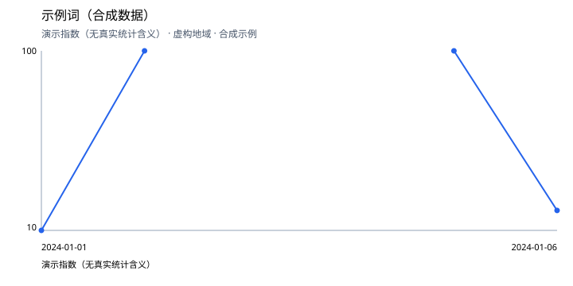

# 词条调查：示例词（合成数据）

- 调查含义：仅演示报告和趋势导入，不代表真实语言材料
- 记录编号：`20260921T150155Z-c3a48691`
- 最近记录更新：2026-09-21T15:01:55+00:00
- 目标范围：公开网页文字，中文优先；实际读取的材料以下方日志为准。

本报告呈现截至本次检索所发现的证据，不证明已经覆盖全网。

## 最早已知记录

纯合成示例，不包含真实词源证据。

尚未确定最早可验证记录；候选和二手说法见证据表。

结论版本：1；此前版本保留于调查 JSON。

## 传播时间线

尚无经整理的传播节点。检索结果的数量不作为传播规模。

## 热度结果

### T001：合成示例

- 词条：示例词（合成数据）；指标：演示指数（无真实统计含义）；地域：虚构地域。
- 覆盖范围：2024-01-01 至 2024-01-06；粒度：day。
- 来源：[合成示例](https://example.com/synthetic)
- 原始数据：[CSV](trends/T001.csv)
- **该序列覆盖范围内的观测峰值：100.0**；时间：2024-01-02；2024-01-05。
- 存在 1 个缺失值，未补零。
- 存在 1 个低于阈值的值，未按精确数值处理。

该结果仅属于上述数据源及查询范围，不代表全网历史最高热度。

## 证据表

尚未记录可引用证据。

## 覆盖范围与调查日志

- 累计会话：1；搜索查询：0；页面访问：0。
- 本轮预算状态：session\_closed

- S001：2026-09-21T15:01:55+00:00 → 2026-09-21T15:01:55+00:00；合成数据演示完成。

## 局限与待办线索

- 所有数值均为人为构造，用于演示并列峰值、缺失值和低于阈值。
- 未被搜索引擎收录、已删除或当前不可访问的内容可能改变结论。
- 年／月级日期保持原精度；发布日期、修改日期和存档日期不互相替代。
